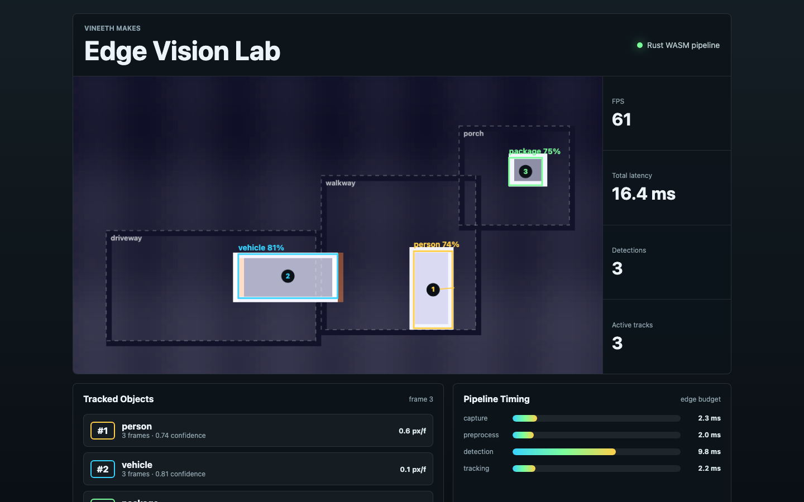
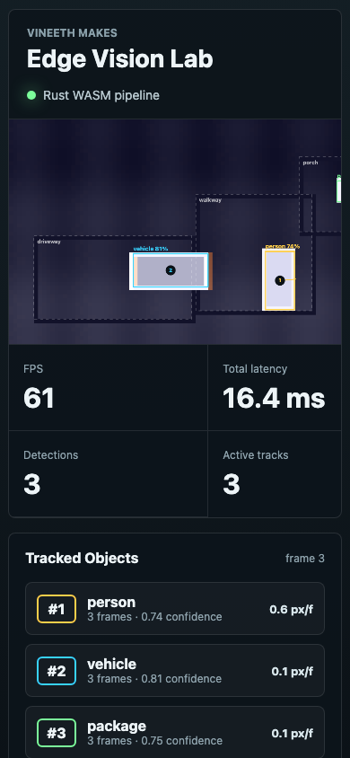

# Edge Vision Lab

Edge Vision Lab is a Rust-powered computer vision sandbox by Vineeth Velmurugan under **Vineeth Makes**. It models the pieces of an edge camera pipeline: calibration, frame preprocessing, motion heatmaps, object detections, lightweight tracking, and latency profiling.

The browser demo runs the Rust pipeline through WebAssembly and visualizes the synthetic camera stream with regions of interest, bounding boxes, track IDs, velocity vectors, and per-stage timing.

## What It Does

- Simulates an edge camera feed with moving people, vehicles, and packages
- Renders calibrated regions of interest for driveway, walkway, and porch zones
- Computes a frame-difference motion heatmap
- Produces detections with confidence, centroid, bounding box, and region assignment
- Maintains stable object tracks with IDs, age, missed-frame cleanup, and velocity
- Estimates capture, preprocessing, detection, tracking, total latency, and FPS
- Exposes the full pipeline snapshot as JSON through a WASM interface
- Displays the live stream, overlays, track table, and timing budget in the browser

## Stack

- Rust for pipeline state, synthetic frames, motion scoring, tracking, tests, and WASM export
- `serde`/`serde_json` for structured snapshots
- `wasm-bindgen`/`wasm-pack` for browser integration
- HTML Canvas for the camera frame, motion heatmap, and overlays
- GitHub Actions for tests, clippy, and WASM builds

## Screenshots





## Run The Rust Checks

```sh
cargo test --workspace --all-targets
cargo clippy --workspace --all-targets -- -D warnings
```

## Run The Browser Demo

Build the Rust crate to WASM:

```sh
wasm-pack build crates/edge-vision --target web --out-dir ../../web/pkg
```

Serve the web folder:

```sh
cd web
python3 -m http.server 8083
```

Then open:

```text
http://localhost:8083
```

## Project Shape

```text
.
├── crates/edge-vision    # Rust vision pipeline, tracking, tests, WASM export
├── web                   # Browser demo consuming the Rust snapshot
└── .github/workflows     # CI
```

## Roadmap

- Add real camera input adapters for RTSP, USB, or prerecorded MP4 streams
- Add polygonal regions instead of rectangular ROIs
- Add a proper background model with decay and shadow suppression
- Add ONNX-based detection behind the current synthetic detector
- Stream snapshots over WebSocket for remote dashboards
- Add benchmark traces for CPU, memory, and frame-to-frame jitter
